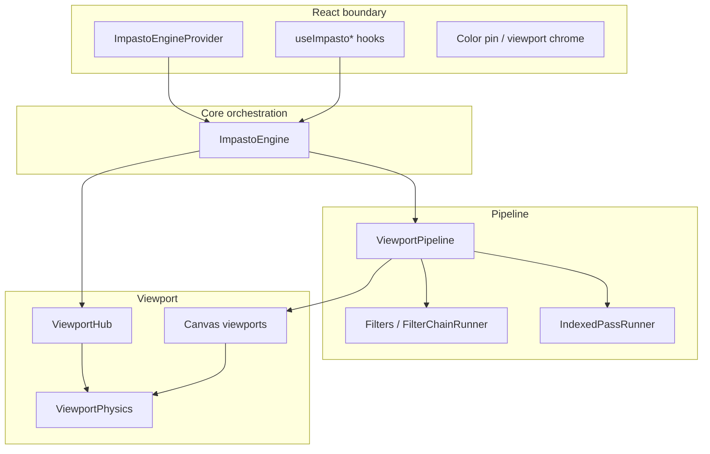

# ImpastoEngine — architecture guidelines

How this package is meant to be structured, how subsystems relate, and where new code should go.

## Principles

- **Scalability:** Prefer subsystem folders over a flat root. New work should land in an obvious home (pipeline, viewport, color pins, tools, and so on).
- **Testability:** Business logic lives in plain TypeScript (classes, functions, state). React components and hooks only wire and render (see repo `CLAUDE.md`).
- **Boundaries:** Leaf modules should not import the `ImpastoEngine` class. Orchestration stays in the composition root; everything else talks through small APIs, callbacks, or shared types.
- **Composition root discipline:** `ImpastoEngine` wires subsystems together and delegates. Logic that belongs to a domain (e.g. color-pin history helpers, drag-session finalization) lives in that domain's module — not inline in the engine.

## Mental model

- **Core** connects tools, selection, color pins, input, and history to the **pipeline** and **viewport** layers.
- **Pipeline** owns filter workers, the index worker, and the three bitmap surfaces (source, filtered, indexed).
- **Viewport** owns shared pan/zoom physics and notifies registered surfaces.

## Target directory layout

Paths are relative to `src/REFACTOR/ImpastoEngine/`. The tables below describe the **current** target tree after subsystem extraction (`pipeline/`, `viewport/`, `core/`, canvas layers, and so on).

| Area                    | Contents (representative)                                                                                                                                                                                                                                                                                                                                                   |
| ----------------------- | --------------------------------------------------------------------------------------------------------------------------------------------------------------------------------------------------------------------------------------------------------------------------------------------------------------------------------------------------------------------------- |
| **`core/`**             | `ImpastoEngine.ts`, `ImpastoEngineApi.ts`, `ImpastoEngineContext.tsx`, `engineConstants.ts`, `ImpastoEngine.test.ts` — composition root, public API surface, provider, shared constants. Snapshot helpers (clone + equality) for each domain live here as small sibling files (e.g. `filterHistorySnapshot.ts`, `colorPinHistorySnapshot.ts`) rather than inline in the engine. |
| **`pipeline/`**         | `ViewportPipeline.ts`, `viewportPipelineTypes.ts`, `viewportPipelineMerger.ts`, `Filters.ts`, `FilterChainRunner.ts`, `filterChainWorkerProtocol.ts`, `filterWorkerBridge.ts`, `filterPassCache.ts`, `IndexedPassRunner.ts`, `indexedPassTypes.ts`, `indexedPassWorkerProtocol.ts`, `pipelineIndexConfig.ts` and their tests — filter/index workers, merged pipeline state. |
| **`viewport/`**         | `Viewport.ts`, `ViewportPhysics.ts`, `viewportHub.ts`, `models.ts`, `ViewportWrapper.tsx`, `ViewportSurfaceContext.tsx` — shared pan/zoom physics, hub, transform models, React viewport shell.                                                                                                                                                                             |
| **`colorPins/`**        | `ColorPinState.ts`, `indexedPaletteFromColorPins.ts`, `enginePaletteSync.ts`, `useImpastoColorPins.ts`, `useImpastoColorPinActions.ts`, `ColorPinSwatch.tsx`, `ColorPinsOverlay.tsx`; **`colorPins/viewports/ViewportColorPins.ts`** keeps canvas layout helpers with the feature (avoids clashing with `viewports/canvas/`).                                               |
| **`selection/`**        | `SelectionState.ts`, `useImpastoSelection.ts` and tests.                                                                                                                                                                                                                                                    |
| **`tools/`**            | `impastoToolRegistry.ts`, `ImpastoTool.ts`, `PanTool.ts`, `SampleColorTool.ts`, `ToolState.ts`, `toolConfigParams.ts`, `toolParamUtils.ts`, `toolInputCombine.ts`, `useImpastoToolsState.ts`.                                                                                                                                                                               |
| **`input/`**            | `InputManager.ts`, `hotkeyBinding.ts`, `engineHotkeys.ts`, `engineHotkeyActions.ts` and tests.                                                                                                                                                                                                                                                                              |
| **`history/`**          | `HistoryManager.ts` (undo/redo or session history successors stay here).                                                                                                                                                                                                                                                                                                    |
| **`hooks/`**            | `useImpastoViewportPipelineState.ts`, `useImpastoViewportTransform.ts`, `useImpastoPipelineFilters.ts` — cross-cutting viewport/pipeline subscriptions.                                                                                                                                                                                                                     |
| **`infra/`**            | `listenerRegistry.ts`, `imageRect.ts` (image-space rects / half-open raster clamps), and similar primitives with no product meaning. Geometry / spatial-math utilities that are used across subsystems belong here.                                                                                                                                                        |
| **`viewports/canvas/`** | Layered canvas implementation; see the table below.                                                                                                                                                                                                                                                                                                                         |

### Canvas subtree (`viewports/canvas/`)

Split by concern so no single directory mixes surfaces, input, drawing, and layout math.

| Layer           | Contents (representative)                                                                                                                                                |
| --------------- | ------------------------------------------------------------------------------------------------------------------------------------------------------------------------ |
| **`surfaces/`** | `ViewportCanvas.ts`, `ViewportCanvasBase.ts`, `SourceViewportCanvas.ts`, `FilteredViewportCanvas.ts`, `IndexedViewportCanvas.ts`.                                        |
| **`host/`**     | `viewportInputPolicy.ts`, `viewportCanvasPointerBridge.ts`, `viewportCanvasGestures.ts`, **`forwardWheelToViewportCanvas.ts`** (wheel forwarding lives with host input). |
| **`chrome/`**   | `viewportCanvasPointerUi.ts`, `sampleColorReticle.ts` and tests — pointer UI and reticle overlays.                                                                       |
| **`render/`**   | `viewportCanvasRenderer.ts`, `viewportCanvasResizer.ts`.                                                                                                                 |
| **`space/`**    | `viewportCanvasSpace.ts` and tests — screen ↔ image coordinate transforms.                                                                                               |

Co-locate tests with sources (`Foo.ts` next to `Foo.test.ts`) inside the same subtree.

## Dependency rules

1. **`ImpastoEngine` (composition root)** may import from subsystems; nothing else should need to import the engine from “below.”
2. **`pipeline/`** must not depend on `ImpastoEngine`. It receives canvas surfaces via constructor injection (interfaces, not concrete classes) and may use `viewport` types, `infra`, and shared model types. It must not import concrete classes from `viewports/canvas/surfaces/` directly.
3. **`viewport/`** must not depend on **`pipeline/`** (prevents cycles). Canvas code may depend on viewport abstractions and local helpers.
4. **Domain folders** (`colorPins`, `selection`, `tools`, `input`, `history`) should not import one another’s implementations unless there is a deliberate, documented coupling; prefer passing callbacks or narrow interfaces from the engine.
   - **Known documented coupling:** `tools/` and `input/` import from each other (`hotkeyBinding`, `ToolState`, `engineHotkeys`). This is intentional — hotkey bindings are defined by tools and consumed by input.
5. **Hooks** should depend on stable surfaces: context, engine API groups, or domain modules — not deep internals of unrelated subsystems. **Hooks must not contain business logic** (coordinate math, state machine transitions, sampling). Extract that to a plain `.ts` class first; the hook only manages React lifecycle and wires it up.
6. **Legacy bridge:** `viewports/canvas/host/viewportCanvasGestures.ts` currently imports from `features/canvas/engine/viewport` (the old architecture). This is a temporary bridge. Do not add new imports from outside `src/REFACTOR/`; migrate those utilities to `infra/` or `viewport/` when the old engine is removed.

## Persistence (`src/REFACTOR/persistence/`)

The persistence layer lives outside `ImpastoEngine/` and owns the Firestore storage adapter, DTOs, and mappers.

- **`PersistenceGlue`** is the integration point: it receives `ImpastoEngine` by reference, subscribes to document changes, and drives autosave + image upload. It may import from `ImpastoEngine/core/` (snapshot types) and `ImpastoEngine/colorPins/` / `ImpastoEngine/pipeline/` for DTO types — but only `type` imports, never concrete class instantiation.
- **`FirestoreStorageAdapter`** implements `IStorageAdapter` and has no knowledge of the engine.
- **Mappers and DTOs** are pure data-transformation functions; they must not import any engine subsystem beyond the types they need for conversion.
- Persistence must not call subsystem internals directly. All reads go through the snapshot API (`engine.getDocumentSnapshot()`); all writes go through the document API (`engine.loadDocument()`).

## Workers and assets

- Workers stay under `src/workers/` (or the project’s existing worker root). Modules under `ImpastoEngine` reference them with relative imports; when nesting folders, adjust depth so worker URLs stay valid for the bundler.
- Keep worker **protocols** and input/output types next to the runner that owns the worker, typically under `pipeline/`.

## Tooling enforcement

### TypeScript path alias

`@impasto/engine/<subsystem>` is the public import path for code outside `src/REFACTOR/`. It is wired up in three places:

| Tool | Config | Value |
|------|--------|-------|
| TypeScript | `tsconfig.app.json` → `compilerOptions.paths` | `"@impasto/engine/*": ["./src/REFACTOR/ImpastoEngine/*"]` |
| Vite | `vite.config.ts` → `resolve.alias` | `'@impasto/engine'` → `./src/REFACTOR/ImpastoEngine` |
| knip | `knip.json` → `ignoreFiles` | `src/REFACTOR/**` is ignored entirely (REFACTOR is in-progress; no false positives) |

> **Future note:** the root `tsconfig.json` is a project-references stub with no `paths` of its own. When non-REFACTOR code starts importing via `@impasto/engine/...`, add a `paths` entry to `knip.json` so knip can resolve alias targets.

### ESLint boundary rules

`eslint.config.js` uses `eslint-plugin-import`'s `import/no-restricted-paths` to enforce a subset of the dependency rules above at lint time:

| Rule | Enforced |
|------|----------|
| 2 — pipeline must not import from core | ✅ `warn` |
| 3 — viewport must not import from pipeline | ✅ `warn` |
| 4 — colorPins must not import from selection (geometry belongs in infra/) | ✅ `warn` |

Rules 1 and 5 (composition-root discipline and hook purity) are documented conventions; they are not mechanically enforceable by import path alone.
